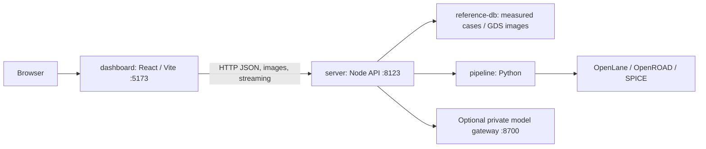

# Frontend, backend and visualization examples

Reviewed 2026-10-04. The application now has independently runnable packages:
`dashboard/` for React/Vite, `server/` for Node HTTP. Python/tool execution and
measured case storage remain backend responsibilities.

The backend serves no frontend assets. It can start without building the UI;
the UI can build without starting the backend or an EDA tool. Configure the
frontend with `VITE_API_BASE_URL` and optional `VITE_GATEWAY_BASE_URL`; configure
the API with `PPA_EDA_SERVER_PORT` and optional `PPA_EDA_FRONTEND_ORIGINS`.
Private keys stay in the root `.env`. Settings are read after that file loads.
See [frontend commands](../dashboard/README.md) and
[backend API](../server/README.md). The API stays bound to loopback.

## Applied visualization changes

- Overview · Examples is the initial screen, showing service connections,
  measured history totals and a stacked candidate-verification distribution.
- Real stored GDS previews carry their source case timestamp. An older available
  image is never labelled as the latest run's image.
- Search and measured/unrecorded filters cover every discovered configuration.
  Opening a recorded example goes to its newest pipeline case; browsing does
  not launch a flow. Analog examples link to the existing Schematic workspace.
- Failed flows, known violations and unknown checks have separate categories.
  Missing check metrics never become zeros. Candidate verification includes model coverage; physical checks alone establish
  neither macro model qualification nor functional equivalence.
- Existing console, status bar, lineage, images and streaming calls use the
  same endpoint configuration. New screens support Korean/English, existing
  light/dark themes and narrow viewports.

## Circuit inventory

`GET /examples` discovers these from actual `pipeline/designs/*/config.json`
and their run specs; the browser joins them with `/reference-db` measurements.
Configured clock periods below are inputs, not achieved-frequency claims.

| Design | Example purpose | Config clock |
| --- | --- | --- |
| `counter4` | Basic 4-bit counter and baseline flow | 10 ns |
| `counter4_tinydie` | Small-die floorplan failure/repair | 10 ns |
| `gcd` | Greatest common divisor, clock sweep | 10 ns |
| `spm` | Unsigned serial/parallel multiplier | 10 ns |
| `cdc_twoclock` | Two clock domains and constraint coverage | 10 ns |
| `riscv32i` | Larger RISC-V processor RTL | 15 ns |
| `aes` | AES cipher and coupled physical repair | 10 ns |
| `sram_wrapper` | SRAM macro placement, timing/model coverage | 20 ns |
| `sram_wrapper_autoplace` | Automatic SRAM macro placement | 20 ns |

The last configuration currently has no stored measured case. Actual counts
are computed live rather than fixed in this document. Checked-in analog
examples include `inv`, `nand2` and the ring oscillator under `pipeline/analog/`;
their schematics and testbenches are available in the Schematic workspace.

## Other visualization examples checked

| Primary source | Verified features | Ideas applied here / possible follow-up |
| --- | --- | --- |
| [SiliconCompiler Dashboard tutorial](https://docs.siliconcompiler.com/en/v0.38.3/user_guide/tutorials/dashboard_tutorial.html) | Project/node metrics, flow graph, file/manifest views, cross-run graphs | Applied: measured summary and design-to-case navigation. Follow-up: compare compatible runs by PDK/SCL/toolchain. |
| [OpenROAD Web Viewer](https://openroad.readthedocs.io/en/latest/main/src/web/README.html) | Browser layout tiles, timing-path highlighting, heatmaps, portable timing report | Applied: actual layout previews with provenance. Follow-up: detailed interactive layer/path viewing after checking the pinned OpenROAD binary's web capabilities. |
| [LanEx](https://github.com/AkshatIsWired/lanex) | LibreLane cockpit, verification evidence, run analytics and design-space exploration | Applied: evidence-first overview and circuit catalog. Follow-up: per-check links into archived reports. |

These are reviewed references, not newly installed dependencies or executed
flows. OpenROAD's current web-viewer documentation does not prove that the
repository's pinned OpenLane image includes those commands. Full tiled viewing,
timing-path highlighting and live heatmaps were not integrated in this change.
No upstream source code, installation scripts or toolchain migration was used.

## Validation

Browser checks used an independently started API on 8124 and frontend on 5174:
all nine circuit cards, real layout image requests, three reference links,
search, unrecorded-only filtering, newest-case navigation, English/Korean,
desktop and 390 px mobile layouts, and light/dark themes. A simulated store
outage left record counts unknown and case buttons unavailable; no invented
zero measurements were shown. The transcript followed the configured API port.

Native file events on this external-volume workspace left stale Vite modules
in the running dev server. The optional `PPA_EDA_WATCH_POLLING=1` setting uses
500 ms polling; default native watching is retained elsewhere. See
[Vite server watcher options](https://vite.dev/config/server-options#server-watch).

Final checks: Python suite completed 1,159 tests (`OK`, 4 skipped), TypeScript /
Vite production build passed, lint had no errors (7 existing Fast Refresh
warnings). The normal frontend/API addresses 5173/8123 were restarted and
verified, including the SRAM card's all-zero recorded physical counts with
model qualification still open. Optional polling delivered a subsequent
`App.tsx` edit through HMR without a restart.
